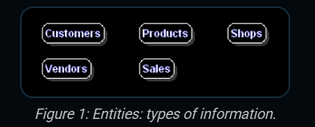
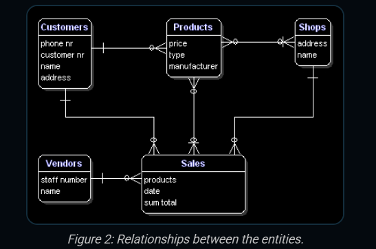
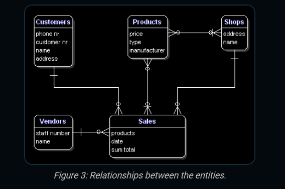
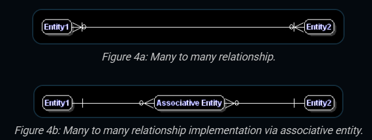
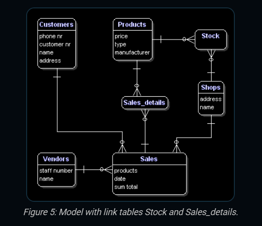

# Basics of Database Modeling - Notes

Here are my notes on the topic of database modeling.

## Review On Identifying Entities

Entities are tables in the database where data is stored. They are very similar to classes in OOP. They fall into four categories: people, which represents data about real people such as vendors, customers, employees, managers, etc; events, which are things that happen, such as sales, deliveries, enrollments, etc; localtions, which are places like cities, addresses, stores, etc; and last but not least, things. They can be any type of object such as clothes, cars or even furniture.

## Identifying Relationships

### Relationships

Relationships between entities tells us how two different tables relate to one another. How many customers are connected to just one sale? How many products can be connected to how many shops?

### Cardinality 

Cardinality refers to the numerical relationship between rows in one table and rows in another table. It basically tells how many instances of an entity relate to how many instances of another one.

### Types Of Relationships

There are four types of relationships. They are: one-to-one, one-to-many, many-to-one, and many-to-many. And they are represented as: 1:1, 1:N, M:1, and M:N. When 'many' is placed on the left, it's represented with 'M', and when placed on the right, it's represented with 'N'.

### Mandatory Relationships

Some entities can have instances independently from others, like a customer entity for example. Customers can exist without any sales or products related to them, however sales can only exist when related to a customer, vendor or a product depending on the business rules being applied.

### Recursive Relationships

Sometimes an entity refers back to itself. For example, think of a work hierarchy: an eployee has a boss and the bosschef is an employee too. The attribute boss of the entity employees refers back to itself.

### Redundant Relationships

Sometimes a relationship can be redundant between two entities because they relate to each other through another entity. In our case, customers and products refer to each other via sales and therefore a direct representation of that relationship is not necessary.

### Many-to-many Relationships

M:N relationships are not directly possible in a database. What a M:N relationship says is that a number of records from one table belong to a number of records in another. Somewhere you need to save which records these are and the solution is to split the relationship up in two 1:N relationships. That can be done by creating a new entity that is between the related entities. In our example there is a M:N relationship between sales and products. This can be solved by creating a new entity called sales_products. In logical models this is called an associative entity and in physical database terms this is called a link table, intersection table or junction table.

